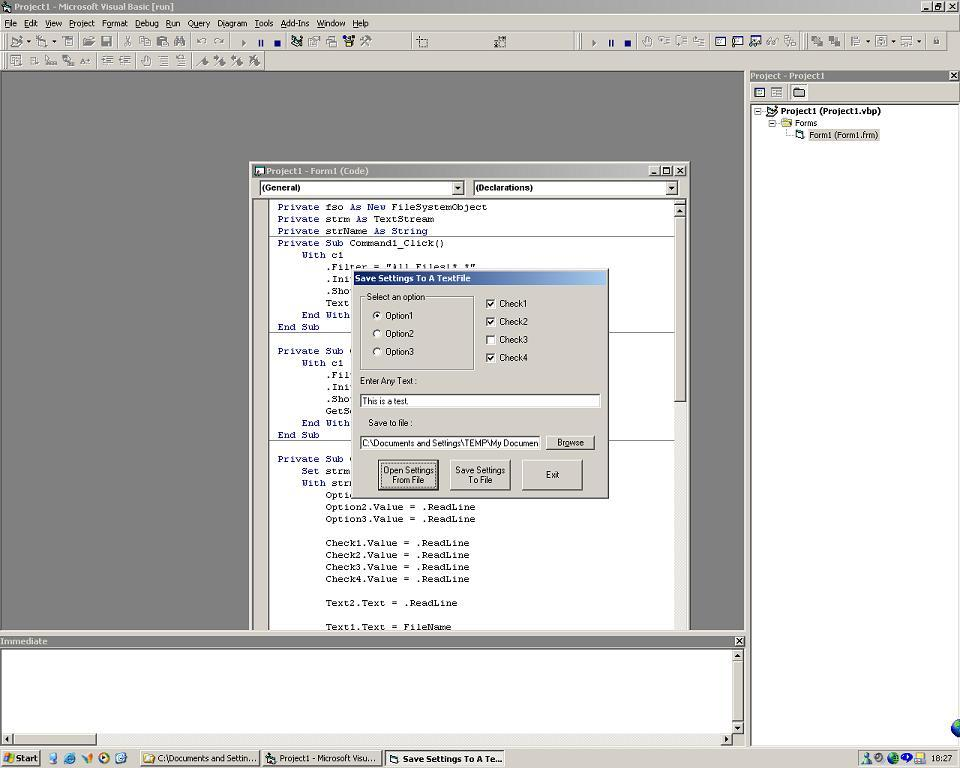



## \_Save/Open Settings To/From A Text File\_

### Description

This code shows you how to save a couple of setting to a text file and open them using a FileSystemObject and a TextStream. For an example of how to combine this with a program, download my BartNet Editor (found on this site).
 
### More Info
 

             |
---                |---
**Submitted On**   |2002-09-23 12:35:04
**By**             |[BelgiumBoy\_007](https://github.com/Planet-Source-Code/PSCIndex/blob/master/ByAuthor/belgiumboy-007.md)
**Level**          |Beginner
**User Rating**    |4.8 (91 globes from 19 users)
**Compatibility**  |VB 6\.0
**Category**       |[Files/ File Controls/ Input/ Output](https://github.com/Planet-Source-Code/PSCIndex/blob/master/ByCategory/files-file-controls-input-output__1-3.md)
**World**          |[Visual Basic](https://github.com/Planet-Source-Code/PSCIndex/blob/master/ByWorld/visual-basic.md)
**Archive File**   |[\_Save\_Open1348949232002\.zip](https://github.com/Planet-Source-Code/belgiumboy-007-save-open-settings-to-from-a-text-file__1-39207/archive/master.zip)

